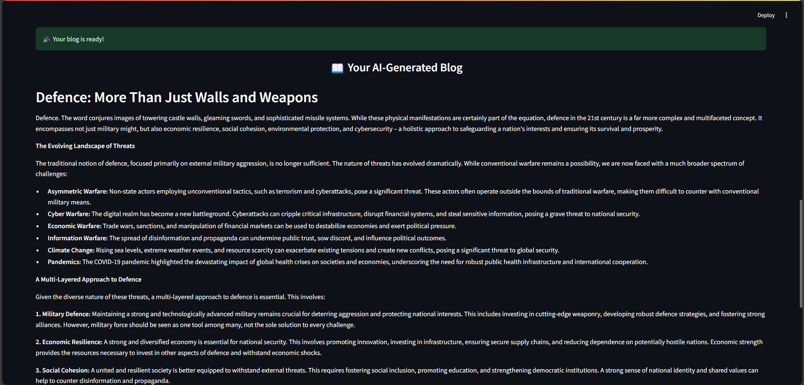
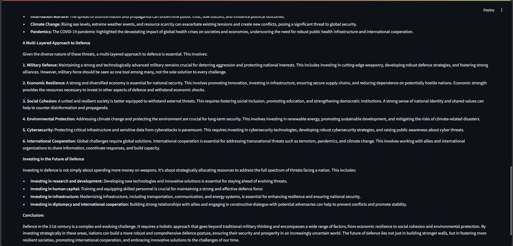

✨ BlogMaster – Your AI-Powered Blogging Assistant

BlogMaster is an intelligent, AI-driven tool designed to help writers, marketers, and bloggers generate well-structured and engaging content in seconds! Powered by Google's Gemini 1.5 Pro, this tool makes content creation effortless, giving you the flexibility to choose your topic and word count while ensuring high-quality output.

This project is part of the Smartbridge Generative AI Course.

🚀 Why Use BlogMaster?

✅ AI-Powered Blog Creation – Generate high-quality content instantly

✅ Custom Word Count Selection – Choose between 100-5000 words

✅ Engaging UI – A visually appealing and intuitive interface

✅ Real-Time Generation – No waiting, get your blog in seconds

✅ Motivational Quotes – Stay inspired while AI crafts your content

📸 Screenshots

⚙️ Installation Guide

🔹 Prerequisites
Python 3.7+
Google Gemini API Key (for AI-based content generation)

🔹 Setup Instructions

1️⃣ Clone the Repository
git clone https://github.com/chetantalele/BlogMaster.git

cd blogmaster

2️⃣ Install Dependencies
pip install -r requirements.txt

3️⃣ Configure API Key
Create a .env file in the project root and add:

GoogleGeminiAPIKey=your_api_key_here

4️⃣ Run the Application
streamlit run app.py

5️⃣ Access the App
Open http://localhost:8501 in your browser.

🎯 How to Use

1️⃣ Enter a Topic – Provide a subject you want to write about

2️⃣ Set Word Count – Use the slider to define your preferred length

3️⃣ Click "Generate Blog" – AI will craft a unique and structured article

4️⃣ Enjoy a Motivational Quote – Stay inspired while your content is generated

5️⃣ View & Copy – Your blog is ready to use!

🔑 How to Get a Google Gemini API Key
Go to Google AI Studio.
Sign in or create an account.
Navigate to "API Keys" in the settings.
Generate a new key and copy it to your .env file.

🛠️ Technologies Used
🔹 Streamlit – For the interactive UI
🔹 Google Generative AI API – For content generation
🔹 Python & Dotenv – For environment management

💡 Contributing
Want to improve BlogMaster? We’d love your contributions! 🎉

📌 Ways to Contribute:

Report issues
Suggest new features
Submit pull requests
📜 License
This project is licensed under the MIT License. See the LICENSE file for details.

💖 Acknowledgments
🔹 Google AI – For the powerful Gemini 1.5 Pro model
🔹 Streamlit – For making web app development easy
🔹 Smartbridge Generative AI Course – For guiding this project

