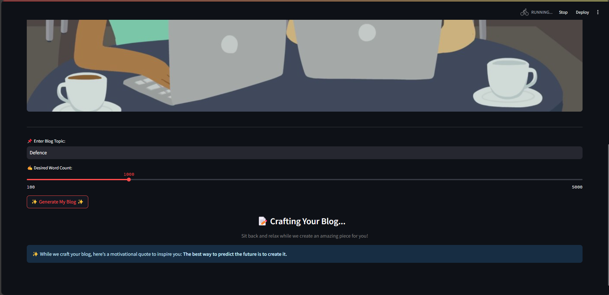

✨ BlogMaster – Your AI-Powered Blogging Assistant
BlogMaster is an intelligent, AI-driven tool designed to help writers, marketers, and bloggers generate well-structured and engaging content in seconds! Powered by Google's Gemini 1.5 Pro, this tool makes content creation effortless, giving you the flexibility to choose your topic and word count while ensuring high-quality output.

This project is part of the Smartbridge Generative AI Course.

🚀 Why Use BlogMaster?
✅ AI-Powered Blog Creation – Generate high-quality content instantly
✅ Custom Word Count Selection – Choose between 100-5000 words
✅ Engaging UI – A visually appealing and intuitive interface
✅ Real-Time Generation – No waiting, get your blog in seconds
✅ Motivational Quotes – Stay inspired while AI crafts your content

📸 Screenshots

⚙️ Installation Guide
🔹 Prerequisites
Python 3.7+
Google Gemini API Key (for AI-based content generation)
🔹 Setup Instructions
1️⃣ Clone the Repository

bash
Copy
Edit
git clone https://github.com/your-username/blogmaster.git
cd blogmaster
2️⃣ Install Dependencies

bash
Copy
Edit
pip install -r requirements.txt
3️⃣ Configure API Key
Create a .env file in the project root and add:

ini
Copy
Edit
GoogleGeminiAPIKey=your_api_key_here
4️⃣ Run the Application

bash
Copy
Edit
streamlit run app.py
5️⃣ Access the App
Open http://localhost:8501 in your browser.

🎯 How to Use
1️⃣ Enter a Topic – Provide a subject you want to write about
2️⃣ Set Word Count – Use the slider to define your preferred length
3️⃣ Click "Generate Blog" – AI will craft a unique and structured article
4️⃣ Enjoy a Motivational Quote – Stay inspired while your content is generated
5️⃣ View & Copy – Your blog is ready to use!

🎨 AI Configuration
Want to tweak the AI behavior? Modify the generation_config in app.py:

python
Copy
Edit
generation_config = {
    "temperature": 0.75,  # Creativity level (higher = more creative)
    "top_p": 0.95,        # Controls token probability sampling
    "top_k": 64,          # Limits token selection range
    "max_output_tokens": 8192,  # Maximum words in the response
}
🔑 How to Get a Google Gemini API Key
Go to Google AI Studio.
Sign in or create an account.
Navigate to "API Keys" in the settings.
Generate a new key and copy it to your .env file.
🛠️ Technologies Used
🔹 Streamlit – For the interactive UI
🔹 Google Generative AI API – For content generation
🔹 Python & Dotenv – For environment management

💡 Contributing
Want to improve BlogMaster? We’d love your contributions! 🎉

📌 Ways to Contribute:

Report issues
Suggest new features
Submit pull requests
📜 License
This project is licensed under the MIT License. See the LICENSE file for details.

💖 Acknowledgments
🔹 Google AI – For the powerful Gemini 1.5 Pro model
🔹 Streamlit – For making web app development easy
🔹 Smartbridge Generative AI Course – For guiding this project

